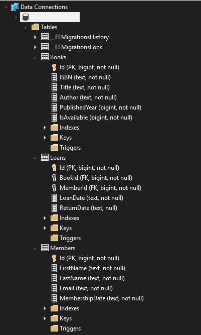

# LibreriaSystem

Det här projektet är ett bibliotekssystem byggt i .NET med Entity Framework Core och Blazor.

Jag har gjort projektet för att kunna hantera:

- böcker
- medlemmar
- utlåning

Systemet sparar data i en SQLite-databas och har ett webbgränssnitt där man kan se och ändra information.

## Projektstruktur

Lösningen innehåller fyra projekt:

- `LibrarySystem.Core`  
  Innehåller modellerna som används i systemet, till exempel `Book`, `Member` och `Loan`.

- `LibrarySystem.Data`  
  Innehåller Entity Framework, `LibraryContext`, repository och databaslogik.

- `LibrarySystem.Web`  
  Innehåller Blazor-gränssnittet.

- `LibrarySystem.Tests`  
  Innehåller enhetstester för repository och databasfunktioner.

## Funktioner

Det går att:

- visa statistik på startsidan
- se alla böcker
- lägga till, redigera och ta bort böcker
- se bokdetaljer
- se alla medlemmar
- lägga till, redigera och ta bort medlemmar
- skapa nya lån
- returnera lån
- ta bort lån

## Databas

Projektet använder SQLite.

Databasfilen ligger i:

`LibrarySystem.Data/db/library.db`

Det finns också Entity Framework migrations i projektet så databasen kan skapas och uppdateras automatiskt.

## Kort databasschema

Databasen består av tre tabeller:

### Books

Används för att spara böcker i biblioteket.

Fält:

- `Id`
- `ISBN`
- `Title`
- `Author`
- `PublishedYear`
- `IsAvailable`

### Members

Används för att spara bibliotekets medlemmar.

Fält:

- `Id`
- `FirstName`
- `LastName`
- `Email`
- `MembershipDate`

### Loans

Används för att spara utlåningar mellan böcker och medlemmar.

Fält:

- `Id`
- `BookId`
- `MemberId`
- `LoanDate`
- `ReturnDate`

Relationer:

- En bok kan ha många lån
- En medlem kan ha många lån
- Ett lån hör till exakt en bok
- Ett lån hör till exakt en medlem

### Databasschema bild

Här är en screenshot av databasschemat:



## Hur man kör projektet

1. Öppna lösningen i Visual Studio eller kör i terminal.
2. Gå till projektmappen.
3. Starta webbprojektet.

Exempel:

```bash
dotnet run --project LibrarySystem.Web
```

Om databasen inte finns så skapas den via migrations när appen startar.

Det finns också seed-data så att systemet får exempeldata från början.

## Testning

Tester finns i projektet `LibrarySystem.Tests`.

Kör tester med:

```bash
dotnet test
```

## Sidor i systemet

- `/` = startsida
- `/books` = boklista
- `/books/{id}` = bokdetaljer
- `/members` = medlemmar
- `/loans` = utlåning
